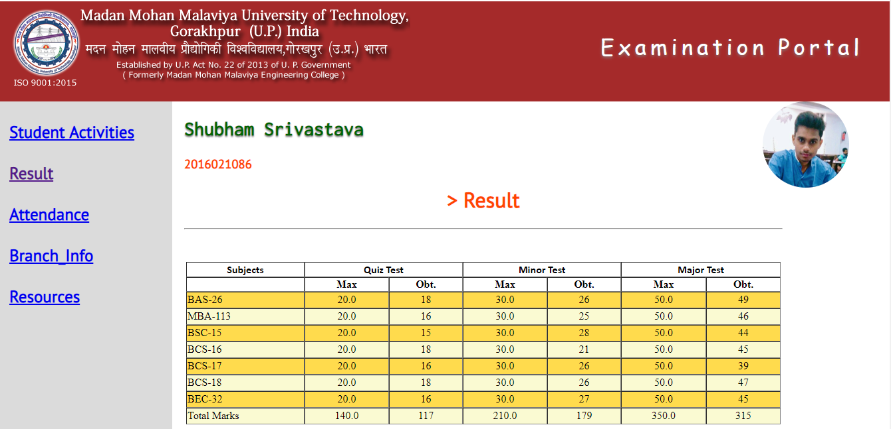
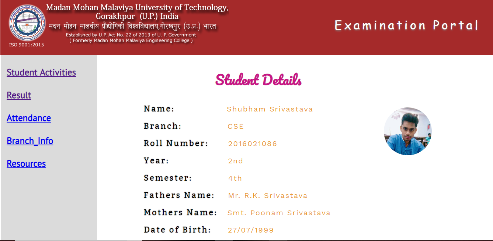
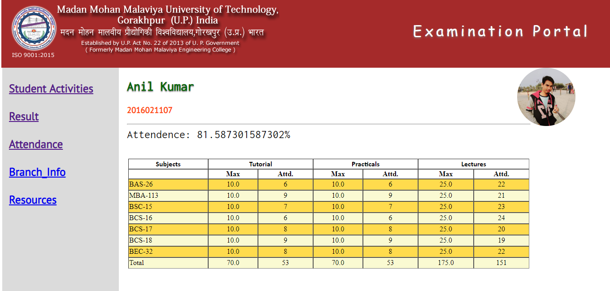
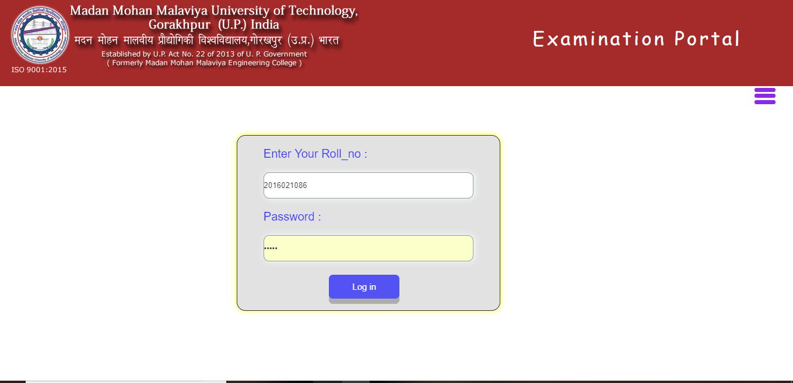
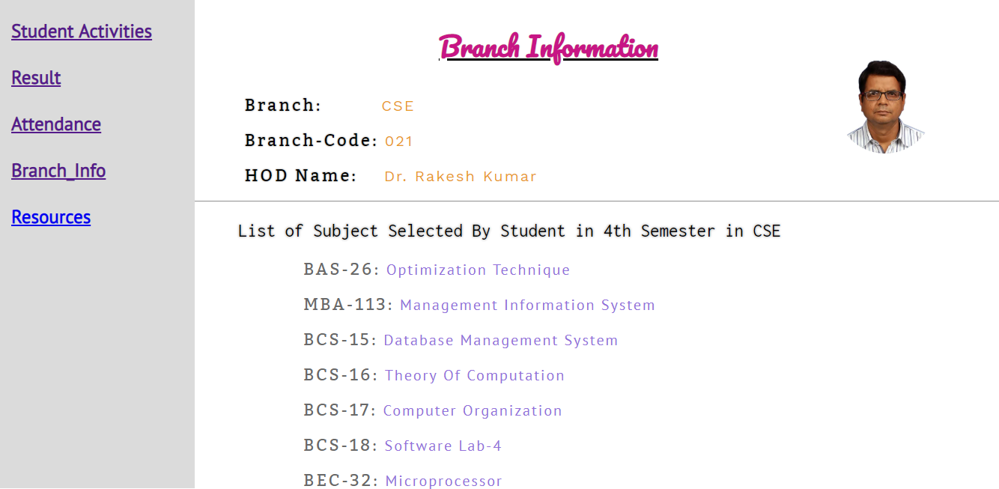

# Student Portal
This Site is my Academic Project in the B.Tech II Year, This site stores the information of student and the display the result. This is fully dynamic website in which php backend is used

## Features
* Displaying the Result of the Students.
* Displaying the Attendance of the Students.
* Displaying the Information of the Student(like father's name, enrollment no. etc)
* Displaying the Information about the Department
* Displaying the Syllabus and Curriculum of the Department

## Technologies
* HTML
* CSS
* Javascript
* PHP
* MySQL

## Screenshots

